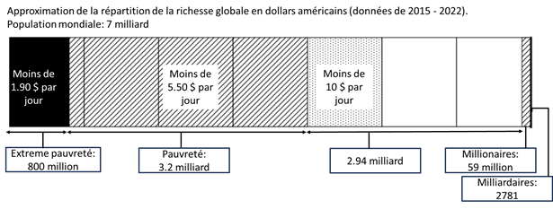
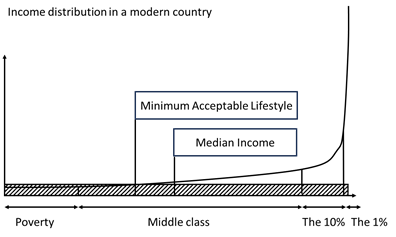

[Retour à l'accueil](../README.md)

# Principes universels pour une société juste et prospère : création de richesse, revenu universel et gouvernance transparente

L’objectif de ce document est de montrer comment créer une société juste et transparente offrant des opportunités de création de richesses et de suppression de la pauvreté. Les inégalités de richesse mondiales existeront toujours, mais le problème de la pauvreté peut être résolu.

## Résumé

Une société moderne protège les droits à la vie privée, à la propriété et à la richesse. Elle protège également les citoyens de la pauvreté en leur fournissant un revenu universel pour leur assurer un niveau de vie minimum acceptable. L’emploi, pour participer à l’effort de production de la société et gagner des revenus supplémentaires, est facultatif, ce qui est rendu possible par la généralisation de la robotisation et de l’intelligence artificielle. Une société moderne exige également une imposition équitable par le biais d’impôts forfaitaires (flat taxe), de la transparence dans les dépenses publiques et d’un système éducatif axé sur les compétences qui contribuent à une croissance sociétale à long terme. 

## Périmètre d'application

Les 8 principes universels sont génériques afin d'être applicables par chaque gouvernement, par tout types de sociétés modernes.

## Les 8 principes universels

### 1 La vie privée et la propriété sont des droits fondamentaux
`Le droit à la vie privée et le droit à la propriété sont des principes fondamentaux qui ne peuvent être modifiés.`

### 2 Tout le monde a la capacité de sécuriser sa richesse
`L'or et le bitcoin sont des protections contre l'inflation monétaire. Tout le monde peut les posséder, les transporter ou les échanger.`
- Chaque entité juridique et chaque citoyen sont libres de détenir de l'or et du bitcoin comme ils le souhaitent : garde, coffres-forts personnels ou portefeuilles. 
- L'or et le bitcoin peuvent être possédés, transportés et échangés sans aucune restriction partout dans le monde, en utilisant des exchanges ou des transactions OTC.

### 3 Les gouvernements ont un contrôle élevé sur l’utilisation de l’argent
`L'utilisation d'une monnaie numérique de banque centrale (MNBC) avec des contrats intelligents permet la mise en œuvre d'un revenu universel intelligent.`

- Un wallet MNBC officiel est mis à disposition de chaque citoyen et il est géré par la Banque centrale et les gouvernements.
- Chaque citoyen peut créer et gérer des portefeuilles MNBC supplémentaires pour ses propres besoins.
- Les gouvernements peuvent fixer l'utilisation de l'argent envoyé aux citoyens : l'aide financière pour les soins de santé ne peut être dépensée qu'à cette fin.
- Les gouvernements peuvent envoyer le revenu universel à chaque citoyen dans leur portefeuille MNBC officiel avec des utilisations fixes : délai d'expiration, usage uniquement à la consommation.

### 4 Chaque citoyen a au moins un niveau de vie minimum acceptable
`Le revenu universel élimine la pauvreté en offrant un niveau de vie minimum acceptable à chaque citoyen.
Pour louer un logement, un système de transport, payer la nourriture, les vêtements, les biens et les services.`

- Le montant du revenu universel correspond au niveau de vie minimum acceptable. Son montant est spécifique à une société. Il est légèrement inférieur au montant total des charges du citoyen médian. Il permet aux citoyens d'avoir un niveau de vie décent dans la société où ils vivent.
- Au début de chaque mois, les gouvernements envoient le revenu universel à chaque citoyen adulte, dans leur portefeuille officiel MNBC. La date d'expiration du revenu est de 3 mois et il ne peut être utilisé que pour la consommation de biens et de services.
- À la fin des 3 mois, le revenu universel est entièrement dépensé par les citoyens ou le reste est reversé au gouvernement.
- Après un certain temps, le montant du revenu universel dépensé par les citoyens est reversé au gouvernement sous forme de TVA.

### 5 Chaque citoyen a le choix de travailler ou non
`L'emploi donne aux citoyens la possibilité de gagner de l'argent et d'augmenter leur richesse au-delà du niveau de vie minimum acceptable.`

- Chaque citoyen est libre d'avoir un emploi pour gagner de l'argent en plus du revenu universel. Ou pas, et de profiter d'une vie de loisirs.
- Lorsqu'un citoyen a un emploi, son salaire est versé à la fin du mois par son employeur.
- En raison du revenu universel, le salaire minimum sera largement réduit, mais suffisamment élevé pour que les citoyens souhaitent occuper le poste de l'emploi.
- Contrairement au revenu universel, le revenu salarial n'a pas de date d'expiration et peut être utilisé de toutes les manières légales : consommation, mais aussi épargne et investissement.
- De nombreux citoyens choisiront de ne pas travailler. Cette perte de main d'œuvre sera compensée par un large recours à l'automatisation, à la robotisation et à l'intelligence artificielle.

### 6 Égalité fiscale pour tous
`Chaque utilisation de monnaie fiduciaire est soumise à un impôt forfaitaire. Les impôts sont égaux pour tous les citoyens et ne font pas obstacle à la création de richesses ni au développement des entreprises.`

- La TVA est appliquée pour chaque acte de consommation, pour chaque citoyen et personne morale. Par exemple, 20%
- Des impôts forfaitaires sur les citoyens et les personnes morales pour tout : revenus, biens immobiliers, capital. Par exemple, 10% sur les revenus, 20% sur les biens immobiliers, 30% sur le capital.

### 7 Le budget et les dépenses du gouvernement sont publics et détaillés
`Rendre publics le budget et les dépenses du gouvernement permet de prévenir la fraude et les abus, ainsi que de créer une gestion financière vertueuse et en amélioration continue.`

- Le budget et les dépenses du gouvernement sont exposés en Open Data et accessibles à chaque citoyen sans restriction. Ils sont mis à jour fréquemment, sur une base mensuelle.
- Seules les dépenses concernant la sécurité nationale ne sont pas détaillées.
- Les citoyens peuvent avoir la possibilité d'affecter une partie de leurs impôts à des dépenses gouvernementales spécifiques.

### 8 Chaque citoyen a droit à une éducation de qualité
`Le système éducatif donne aux citoyens les capacités de comprendre et de participer efficacement à la société.
Pour une croissance sociétale à long terme, et aider chaque citoyen à atteindre ses propres objectifs ainsi que ceux de la société.`

Le programme éducatif inclus des compétences transverses pour chaque domaine (Maths, Histoire, Sciences, Sport, Philosophie, Littérature, ...):
- La résolution de problèmes
- La capacité à travailler en groupe, ainsi que seul
- L'utilisation d'outils informatiques modernes et le développement de compétences en programmation
- Les connaissances financières liées aux métiers du domaine d'étude
- Les connaissances juridiques lié aux métiers du domaine d'étude

Les niveaux d'études sont validés par des examens finaux, des évaluations continues et l'utilisation d'un système de classement numérique.

## Références

Pauvreté extrême: https://en.wikipedia.org/wiki/Extreme_poverty

Les millionnaires dans le monde: https://greenlight.com/learning-center/fun-facts/how-many-millionaires-in-the-world

Les milliardaires dans le monde: https://en.wikipedia.org/wiki/List_of_countries_by_number_of_billionaires

Répartition mondiale des revenus: https://ourworldindata.org/global-economic-inequality-introduction

L’or comme protection contre l’inflation: https://www.forbes.com/advisor/investing/gold-inflation-hedge/

Le Bitcoin comme protection contre l’inflation: https://www.ccn.com/education/the-truth-behind-bitcoins-inflation-hedge-theory/

Le revenu universel: https://en.wikipedia.org/wiki/Universal_basic_income

Monnaie numérique de Banque centrale: https://www.investopedia.com/terms/c/central-bank-digital-currency-cbdc.asp

[Retour à l'accueil](../README.md)
